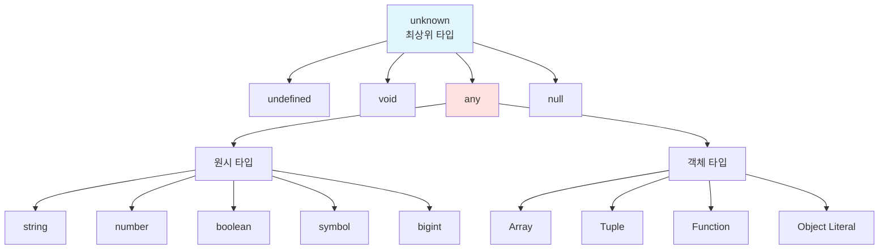
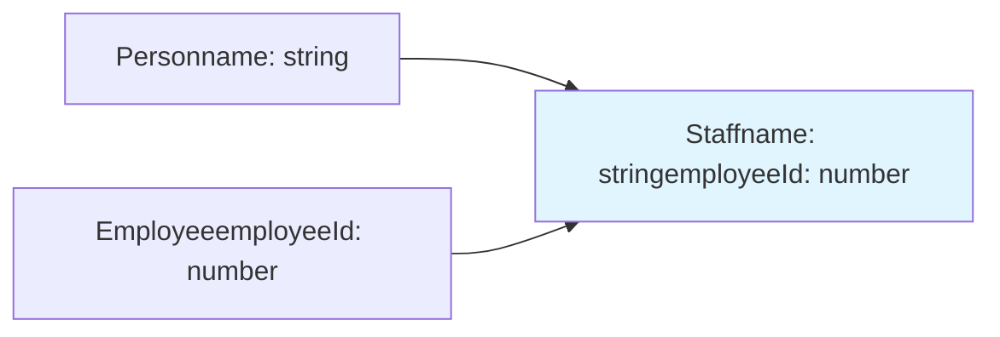
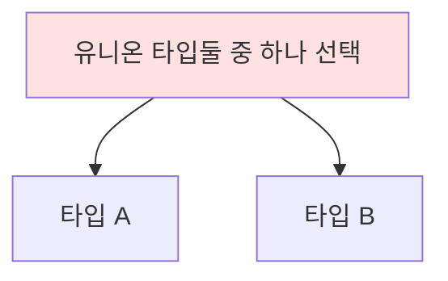

# 고급 타입
## 타입스크립트만의 독자적 타입 시스템
타입스크립트는 자바스크립트의 자료형을 기반으로 독자적인 타입 시스템을 구축하고 있다.
> 엄밀히 말하면 타입스크립트의 타입 시스템이 내포하고 있는 개념은 모두 자바스크립트에서 기인한다.
> 단지 자바스크립트로 표현할 수단과 필요성이 없었을 뿐이다.

### 타입스크립트의 계층구조

### 1. any
- 자바스크립트에 존재하는 모든 값을 오류 없이 받을 수 있다. 
- 타입을 명시하지 않은 것과 동일하며 타입 검사를 완전히 우회한다.
```ts
let state: any;

state = 1;        
state = "hello";  
state = {};       
state.foo.bar;    // 오류 없음 (런타임 에러 가능성)
```
**타입 강제하기**
```json
{
  "compilerOptions": {
    "noImplicitAny": true  // 암묵적 any 금지
  }
}
```
**any를 사용해야 하는 경우**
- 개발 단계에서 임시로 값을 지정할 때
- 어떤 값을 받아올지 또는 넘겨줄지 정할 수 없을 때 (예: API 요청 및 응답 처리)
- 값을 예측할 수 없을 때 암묵적으로 사용 (예: `Promise<any>`)

### 2. unknown
- 무엇이 할당될지 아직 모르는 상태의 타입
- 어떤 값이든 올 수 있지만 개발자에게 엄격한 타입 검사를 강제
```ts
let unknownValue: unknown;

// 할당은 자유롭게 가능
unknownValue = 100;
unknownValue = "hello";
unknownValue = true;

// 사용할 때는 에러 발생
console.log(unknownValue.length);  // 컴파일 에러
unknownValue.toUpperCase();        // 컴파일 에러
```
**타입 가드를 통한 안전한 사용**
```ts
function processValue(value: unknown) {
  if (typeof value === 'string') {
    console.log(value.toUpperCase());  
  } else if (typeof value === 'number') {
    console.log(value.toFixed(2));    
  }
}
```
**any와 unknown의 할당 규칙**
```ts
let unknownVar: unknown = 10;
let anyVar: any = 10;

let num1: number = anyVar;      // any는 어디든 할당 가능
let num2: number = unknownVar;  // ❌ unknown은 any 외에는 할당 불가
let anyVar2: any = unknownVar;  // ✅
```
```ts
let unknownVar: unknown = 10;
let anyVar: any = 10;

// any는 자유로움 - 어디든 할당 가능
let num1: number = anyVar;  //

// unknown은 엄격함 - 타입 체크 없이는 못 넘김
let num2: number = unknownVar;  // 에러!
let anyVar2: any = unknownVar;  // any에만 가능
```
**any vs unknown 비교**

| 특성 | any | unknown |
|------|-----|---------|
| 모든 타입 할당 | ✅ | ✅ |
| 다른 타입에 할당 | ✅ 제한 없음 | ❌ any만 가능 |
| 타입 검사 | ❌ 우회됨 | ✅ 강제됨 |
| 프로퍼티 접근 | ✅ 자유롭게 가능 | ❌ 타입 확인 필요 |
| 타입 안정성 | 낮음 | 높음 |

> 구조를 파악하기 힘들 때 any보다 unknown 사용을 권장한다.

 ### 3. void 타입
함수가 어떤 값을 반환하지 않는 경우에 사용
```ts
// 반환값이 없는 함수
function printMessage(message: string): void {
  console.log(message);
}

// 이벤트 핸들러
function handleClick(event: MouseEvent): void {
  console.log("클릭됨");
}

// 콜백 함수
function forEach(arr: number[], callback: (item: number) => void): void {
  for (const item of arr) {
    callback(item);
  }
}
```

### 4. never 타입
값을 반환할 수 없는 타입
**1. 에러를 던지는 경우**
```ts
function throwError(message: string): never {
  throw new Error(message);
}
```

**2. 무한 루프**
```ts
function infiniteLoop(): never {
  while (true) {
    console.log("무한 루프");
  }
}
```
**never 타입의 특징**
never는 모든 타입의 하위 타입. never는 모든 타입에 할당 가능하지만 어떤 타입도 never에 할당할 수 없다.
```ts
let neverValue: never;
let num: number = neverValue;     // ✅
let str: string = neverValue;     // ✅

let neverValue2: never;
neverValue2 = 123;                // ❌
neverValue2 = undefined;          // ❌
```

### 5. Array 타입
기본 배열 타입
```ts
// 두 가지 표현 방법
let numbers: number[] = [1, 2, 3];
let strings: Array = ["a", "b", "c"];

// 여러 타입 혼합
let mixed: (number | string)[] = [1, "two", 3];

// 읽기 전용
let readonly: readonly number[] = [1, 2, 3];
```
### 6. Tuple
길이와 각 요소의 타입이 고정된 배열
```ts
// 기본 사용
let tuple: [string, number] = ["hello", 123];

tuple = [123, "hello"];  // ❌ 순서가 다름
tuple = ["hello"];       // ❌ 길이가 다름

// 옵셔널 요소
let optional: [string, number, boolean?];

optional = ["hello", 123];        // ✅
optional = ["hello", 123, true];  // ✅
```

**React useState**
```ts
const [count, setCount] = useState(0);
//     ^^^^^ number
//            ^^^^^^^^ Dispatch<SetStateAction>
```

### 7. enum

특정 값들의 집합을 정의할 때 사용하는 열거형이다.
```ts
// 숫자 enum (0부터 자동 할당)
enum Direction {
  Up,      // 0
  Down,    // 1
  Left,    // 2
  Right    // 3
}

// 문자열 enum
enum Status {
  Pending = "PENDING",
  Success = "SUCCESS",
  Error = "ERROR"
}
```

**enum 타입의 효과**

1. **코드 가독성 향상**
```ts
// ❌ 숫자로만 표현
setStatus(0);

// ✅ enum 사용
enum OrderStatus { Pending, Processing, Completed }
setStatus(OrderStatus.Pending);
```

2. **타입 안정성**
```ts
enum PaymentMethod {
  Card = "CARD",
  Cash = "CASH"
}

function pay(method: PaymentMethod) { }

pay(PaymentMethod.Card);  // ✅
pay("CARD");              // ❌
```

3. **자동 완성 및 리팩토링 용이**

**const enum (최적화)**
```ts
const enum Direction {
  Up,
  Down
}

let dir = Direction.Up;
// 컴파일 후: let dir = 0;
```

## 타입 조합
### 교차 타입 (Intersection Type)

여러 타입을 모두 만족하는 타입. `&` 사용.
```ts
type Person = { name: string };
type Employee = { employeeId: number };

type Staff = Person & Employee;

const staff: Staff = {
  name: "Alice",
  employeeId: 1234
  // 모든 속성이 필요
};
```


---

### 유니온 타입 (Union Type)

여러 타입 중 하나를 만족하는 타입. `|` 사용.
```ts
type Result = 
  | { success: true; data: User }
  | { success: false; error: string };

function handleResult(result: Result) {
  if (result.success) {
    console.log(result.data);
  } else {
    console.log(result.error);
  }
}

// 기본 사용
let value: string | number;
value = "hello";  // ✅
value = 123;      // ✅
```

---

### 인덱스 시그니처 (Index Signature)

객체의 키와 값 타입을 동적으로 정의한다.
```ts
type StringMap = {
  [key: string]: string;
};

const obj: StringMap = {
  name: "Alice",
  city: "Seoul",
  anything: "works"  // 어떤 키든 가능
};

// Record 유틸리티 타입 (더 간결)
type Dict = Record;
```
---

### 인덱스 접근 타입 (Indexed Access Type)

다른 타입의 특정 속성 타입을 추출할 때 사용한다. `Type[Key]` 형태.
```ts
type User = {
  name: string;
  age: number;
  email: string;
};

// 속성 타입 추출
type UserName = User["name"];  // string
type UserInfo = User["name" | "email"];  // string

// 배열 요소 타입 추출
type Users = User[];
type SingleUser = Users[number];  // User

const colors = ["red", "green", "blue"] as const;
type Color = typeof colors[number];  // "red" | "green" | "blue"
```

---
### 맵드 타입 (Mapped Type)

기존 타입의 속성을 순회하며 새로운 타입을 생성한다.
```ts
type Mapped = {
  [K in keyof T]: T[K];
};
```

**기본 예시**
```ts
type User = {
  name: string;
  age: number;
};

// 모든 속성을 optional로
type PartialUser = {
  [K in keyof User]?: User[K];
};

// 모든 속성을 readonly로
type ReadonlyUser = {
  readonly [K in keyof User]: User[K];
};
```

**내장 유틸리티 타입**
```ts
// Partial - 모든 속성 선택적으로
type UpdateUser = Partial;

// Required - 모든 속성 필수로
type RequiredUser = Required;

// Readonly - 모든 속성 읽기 전용
type ReadonlyUser = Readonly;

// Pick - 특정 속성만 선택
type UserBasic = Pick;

// Omit - 특정 속성 제외
type UserWithoutPassword = Omit;

// Record - 키-값 타입 생성
type UserRecord = Record;
```

---

### 템플릿 리터럴 타입 (Template Literal Type)

문자열 리터럴 타입을 조합하여 새로운 문자열 타입을 생성한다.
```ts
type World = "world";
type Greeting = `hello ${World}`;  // "hello world"

// 여러 조합 생성
type Color = "red" | "blue";
type Size = "small" | "large";
type Style = `${Color}-${Size}`;
// "red-small" | "red-large" | "blue-small" | "blue-large"

// 이벤트 핸들러
type EventName = "click" | "focus" | "blur";
type Handler = `on${Capitalize}`;
// "onClick" | "onFocus" | "onBlur"
```

**문자열 조작 유틸리티**
```ts
type Upper = Uppercase;        // "HELLO"
type Lower = Lowercase;        // "hello"
type Cap = Capitalize;         // "Hello"
type Uncap = Uncapitalize;     // "hello"
```

---

### 제네릭 (Generic)

재사용 가능한 타입을 만들기 위한 도구. 타입을 파라미터처럼 사용한다.

**기본 문법**
```ts
function identity(value: T): T {
  return value;
}

identity(123);     // T = number
identity("hello");         // T = string (타입 추론)
```

**제약 조건 (Constraints)**
```ts
// extends로 제약
interface HasLength {
  length: number;
}

function logLength(item: T): void {
  console.log(item.length);
}

logLength("hello");    // ✅
logLength([1, 2, 3]);  // ✅
logLength(123);        // ❌

// keyof로 제약
function getProperty(obj: T, key: K): T[K] {
  return obj[key];
}

const user = { name: "Alice", age: 30 };
getProperty(user, "name");   // ✅
getProperty(user, "email");  // ❌
```

**인터페이스 제네릭**
```ts
interface ApiResponse {
  data: T;
  status: number;
  message: string;
}

type UserResponse = ApiResponse;
type PostResponse = ApiResponse;
```

**실무 예시**
```ts
// API 클라이언트
class ApiClient {
  async get(url: string): Promise {
    const response = await fetch(url);
    return response.json();
  }
}

const client = new ApiClient();
const user = await client.get("/api/user");
const posts = await client.get("/api/posts");
```
