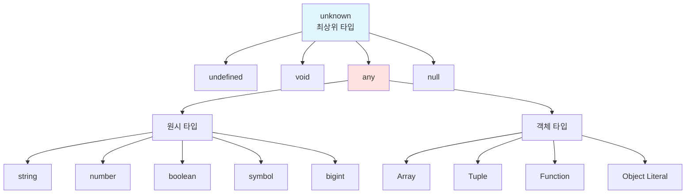
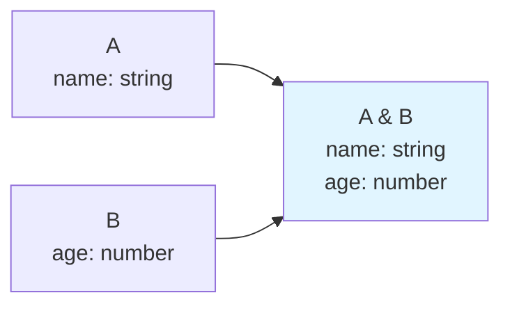
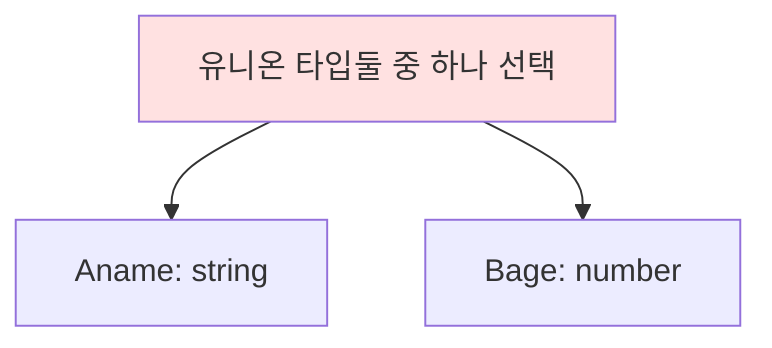

# 고급 타입
## 타입스크립트만의 독자적 타입 시스템
타입스크립트는 자바스크립트의 자료형을 기반으로 하면서도 독자적인 타입 시스템을 구축하고 있다.
> 참고: 엄밀히 말하면 타입스크립트의 타입 시스템이 내포하고 있는 개념은 모두 자바스크립트에서 기인함
> 단지 자바스크립트로 표현할 수단과 필요성이 없었을 뿐
- 타입스크립트의 계층구조

### 1. any
- 자바스크립트에 존재하는 모든 값을 오류 없이 받을 수 있음
- 타입을 명시하지 않은 것과 동일
```ts
let state: any;

state = 1;        // OK
state = "hello";  // OK
state = {};       // OK
```
- tsconfig.json에서 noImplicitAny 옵션을 통해 타입을 강제할 수 있다. (암묵적 any 금지)
```json
{
  "compilerOptions": {
    "noImplicitAny": true
  }
}
```
- any타입을 어쩔 수 없이 사용해야 되는 상황도 있음
  - 개발단계에서 임시로 값을 지정할때
  - 어떤 값을 받아올지 또는 넘겨줄지 정할 수 없을 때 ex) API 요청 및 응답 처리
  - 값을 예측할 수 없을때 암묵적으로 사용 ex) promise<any>

### 2. unknown
- 무엇이 할당될지 아직 모르는 상태의 타입
```ts
let unknownValue: unknown;// 할당은 자유롭게 가능
unknownValue = 100;
unknownValue = "hello";
unknownValue = true;// 하지만 사용할 때는 에러 발생
console.log(unknownValue.length);  // 컴파일 에러!
unknownValue.toUpperCase();        // 컴파일 에러!
```
- **어떤 값이든 올 수 있음** 의미하는 동시에 **개발자에게 엄격한 타입 검사를 강제하는 의도**를 가짐
- any 타입과 유사하지만 타입 검사를 강제하고 **타입이 식별된 후에 사용**할 수 있어 any 보다 안전
```ts
function processValue(value: unknown) {
  // 타입 가드를 통해 타입을 좁혀야 사용 가능
  if (typeof value === 'string') {
    console.log(value.toUpperCase());  // string으로 확인됨
  } else if (typeof value === 'number') {
    console.log(value.toFixed(2));     // number로 확인됨
  }
}
```
-  unknown 타입 변수는 뭐든 받을 수 있지만, unknown 값을 다른 곳에 넘기려면 any만 가능합니다.
```ts
let unknownVar: unknown = 10;
let anyVar: any = 10;

// any는 자유로움 - 어디든 할당 가능
let num1: number = anyVar;  //

// unknown은 엄격함 - 타입 체크 없이는 못 넘김
let num2: number = unknownVar;  // 에러!
let anyVar2: any = unknownVar;  // any에만 가능
```
#### any와 unknown 비교(표)
| 특성 | any | unknown |
|------|-----|---------|
| **모든 타입 할당** | 가능 | 가능 |
| **다른 타입에 할당** | 제한 없음 | any를 제외하고 불가 |
| **타입 검사** | 우회됨 | 강제됨 |
| **프로퍼티 접근** | 자유롭게 가능 | 타입 확인 필요 |
| **타입 안정성** | 낮음 | 높음 |
| **사용 권장도** | 최소화 | any 대신 권장 |
> **구조를 파악하기 힘들때 any보다 unknown 사용을 권장함!!**

 ### 3. void 타입
 -  void는 "반환값이 없다"는 의도를 명확히 표현
```ts
// 반환값이 없는 함수
function printMessage(message: string): void {
  console.log(message);
  // return 문이 없거나 return만 있음
}

// 이벤트 핸들러
function handleClick(event: MouseEvent): void {
  console.log("클릭됨");
}

// 콜백 함수
function forEach(arr: number[], callback: (item: number) => void): void {
  for (const item of arr) {
    callback(item);
  }
}
```

### 4. never 타입
- 값을 반환할 수 없는 타입
1. 에러를 던지는 경우
```ts
function throwError(message: string): never {
  throw new Error(message);
  // 함수가 정상적으로 끝나지 않음
}

function fail(msg: string): never {
  throw new Error(msg);
}
```
2. 무한히 함수가 실행되는 경우
```ts
function infiniteLoop(): never {
  while (true) {
    console.log("무한 루프");
  }
  // 함수가 절대 종료되지 않음
}
```
- never 타입은 모든 타입의 하위 타입
> never는 모든 타입에 할당 가능하지만, 어떤 타입도 never에 할당할 수 없습니다 (never 자신 제외)
```ts
// never는 다른 타입에 할당 가능
let neverValue: never;
let num: number = neverValue;     // OK
let str: string = neverValue;     // OK

// 하지만 다른 타입은 never에 할당 불가
let neverValue2: never;
neverValue2 = 123;                // 에러
neverValue2 = "hello";            // 에러
neverValue2 = undefined;          // 에러
```

### 5. Array 타입
- 기본 배열 타입
```ts
// 두 가지 표현 방법
let numbers: number[] = [1, 2, 3];
let strings: Array = ["a", "b", "c"];

// 여러 타입 혼합
let mixed: (number | string)[] = [1, "two", 3];

// 읽기 전용
let readonly: readonly number[] = [1, 2, 3];
```
- 튜플: **튜플**은 길이와 각 요소의 타입이 고정된 배열
```ts
// [타입1, 타입2, ...]
let tuple: [string, number] = ["hello", 123];
let optional: [string, number, boolean?]; //옵셔널 프로퍼티

tuple = [123, "hello"];  // ❌ 순서가 다름
tuple = ["hello"];       // ❌ 길이가 다름
```
> 리액트에서는 useState

### 6. enum 타입
- enum은 열거형으로, 특정 값들의 집합을 정의할 때 사용
```ts
// 숫자 enum (기본값: 0부터 시작)
enum Direction {
  Up,      // 0
  Down,    // 1
  Left,    // 2
  Right    // 3
}

let dir: Direction = Direction.Up;
console.log(dir);  // 0

// 값 지정 가능
enum Status {
  Pending = 0,
  Success = 1,
  Error = 2
}
```
#### enum 타입의 효과

**1. 코드 가독성 향상**
```ts
// ❌ 숫자로만 표현
setStatus(0);

// ✅ enum 사용 - 의미 명확
enum OrderStatus { Pending, Processing, Completed }
setStatus(OrderStatus.Pending);
```

**2. 타입 안정성**
```ts
enum PaymentMethod {
  Card = "CARD",
  Cash = "CASH"
}

function pay(method: PaymentMethod) { }

pay(PaymentMethod.Card);  // ✅
pay("CARD");              // ❌ 에러
```

**3. 자동 완성 및 리팩토링 용이**
```ts
enum ApiEndpoint {
  Users = "/api/users",
  Posts = "/api/posts"
}

// IDE 자동 완성 지원
fetch(ApiEndpoint.Users);
```

#### const enum (최적화)
```ts
const enum Direction {
  Up,
  Down
}

let dir = Direction.Up;
// 컴파일 후: let dir = 0; (인라인화로 번들 크기 감소)
```

## 타입 조합
### 교차 타입 (Intersection Type)

여러 타입을 **모두** 만족하는 타입. `&` 사용.
```ts
type A = { name: string };
type B = { age: number };

type C = A & B;  // 둘 다 필요

const person: C = {
  name: "Alice",
  age: 30
  // 둘 다 있어야 함!
};
```


---

### 유니온 타입 (Union Type)

여러 타입 중 **하나**를 만족하는 타입. `|` 사용.
```ts
type A = { name: string };
type B = { age: number };

type D = A | B;  // 둘 중 하나

const person1: D = { name: "Bob" };        
const person2: D = { age: 25 };          
const person3: D = { name: "C", age: 30 };
```

---

### 인덱스 시그니처 (Index Signature)

객체의 키와 값 타입을 **동적으로** 정의. [key: K]: T
```ts
type StringMap = {
  [key: string]: string;
};

const obj: StringMap = {
  name: "Alice",
  city: "Seoul",
  anything: "works"  // 어떤 키든 가능
};
```
### 인덱스 엑세스 타입 (Indexed Access Type)
- 다른 타입의 **특정 속성 타입**을 추출할 때 사용. `Type[Key]` 형태.
```ts
type User = {
  name: string;
  age: number;
  email: string;
};

// User 타입의 name 속성 타입 추출
type UserName = User["name"];  // string
type UserAge = User["age"];    // number

// 여러 속성 타입 추출
type UserInfo = User["name" | "email"];  // string | string = string
```
- 배열 요소 타입 추출
```ts
type Users = User[];

// 배열 요소의 타입 추출
type SingleUser = Users[number];  // User

const colors = ["red", "green", "blue"] as const;
type Color = typeof colors[number];  // "red" | "green" | "blue"
```

### 맵드 타입 (Mapped Type)
- 기존 타입의 속성을 순회하며 **새로운 타입을 생성**
- 반복적인 타입 선언을 효율적으로 처리.
```ts
type Mapped = {
  [K in keyof T]: T[K];
};
```
#### 기본 예시
```ts
type User = {
  name: string;
  age: number;
  email: string;
};

// 모든 속성을 optional로
type PartialUser = {
  [K in keyof User]?: User[K];
};
// { name?: string; age?: number; email?: string; }

// 모든 속성을 readonly로
type ReadonlyUser = {
  readonly [K in keyof User]: User[K];
};
```
#### 내장 유틸리티 타입
```ts
// Partial - 모든 속성 선택적으로
type UpdateUser = Partial;

// Required - 모든 속성 필수로
type RequiredUser = Required;

// Readonly - 모든 속성 읽기 전용
type ReadonlyUser = Readonly;

// Pick - 특정 속성만 선택
type UserBasic = Pick;

// Omit - 특정 속성 제외
type UserWithoutPassword = Omit;

// Record - 키-값 타입 생성
type UserRecord = Record;
```
### 템플릿 리터럴 타입 (Template Literal Type)

문자열 리터럴 타입을 **조합**하여 새로운 문자열 타입을 생성.

#### 기본 사용법
```ts
// 문자열 조합
type World = "world";
type Greeting = `hello ${World}`;  // "hello world"

// 여러 조합 생성
type Color = "red" | "blue";
type Size = "small" | "large";
type Style = `${Color}-${Size}`;
// "red-small" | "red-large" | "blue-small" | "blue-large"
```

### 제네릭 (Generic)

**재사용 가능한 타입**을 만들기 위한 도구. 타입을 **파라미터**처럼 사용.

#### 기본 문법
```ts
// 함수 제네릭
function identity(value: T): T {
  return value;
}

identity(123);     // T = number
identity("hello"); // T = string
identity(true);            // T = boolean (타입 추론)
```
#### 제약 조건 (Constraints)
```ts
// extends로 제약
interface HasLength {
  length: number;
}

function logLength(item: T): void {
  console.log(item.length);
}

logLength("hello");        // ✅ string은 length 있음
logLength([1, 2, 3]);      // ✅ array는 length 있음
logLength(123);            // ❌ number는 length 없음

// keyof로 제약
function getProperty(obj: T, key: K): T[K] {
  return obj[key];
}

const user = { name: "Alice", age: 30 };
getProperty(user, "name");   // ✅ "Alice"
getProperty(user, "email");  // ❌ 에러
```
